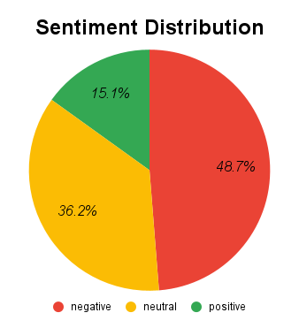

# Sentiment Analysis Pipeline with Google Sheets + Gemini API

## 📌 Overview

### This project is a simple pipeline for performing **sentiment analysis** on TikTok comments in Indonesian.

Tiktok Comments scrapped from -> [Tiktok URL List](tiktok-url-list.txt)

It combines:

- **Apify** (for scraping TikTok comments),
- **Google Sheets** (as the data hub),
- **Gemini API** (for sentiment classification).

👉 [View Dataset Here](https://docs.google.com/spreadsheets/d/1D0vJKgS5tj38mYEff97mGi8_bWGMG_LBkfIE59HTK-A/edit?usp=sharing)

---

## 📂 Project Structure

```directory
📦 Analyzing-Public-Opinion-on-Government-Policy-using-Gemini-AI
 ┣ 📂script
 ┃ ┣ 📜cleaning.py
 ┃ ┣ 📜credentials.json
 ┃ ┣ 📜main.py
 ┃ ┗ 📜summary.py
 ┣ 📂slide-deck
 ┃ ┣ 📜deck.pdf
 ┣ 📜.env
 ┣ 📜.gitattributes
 ┣ 📜.gitignore
 ┣ 📜accounts.db
 ┣ 📜README.md
 ┗ 📜tiktok-url-list.txt
```

---

## 🔄 Workflow

1. **Data Collection (Apify → CSV → Google Sheets)**
   - Extract TikTok comments using [Apify TikTok Scraper](https://apify.com/apify/tiktok-scraper).
   - Download the scraped data as a **CSV file**.
   - Upload the CSV file into **Google Sheets**, worksheet: `Clean`.

2. **Data Cleaning (`cleaning.py`)**
   - Make a worksheet for cleaned data (`Clean`)
   - Run Cleaning Function that:
     1. Remove emoticons (non-ASCII) with `encode("ascii", "ignore")` and `decode()`
     2. Lowercase the comments with `lower()`
     3. Remove whitespace at the beginning and end of comments with `strip()`
     4. Remove specific symbols such as `@ # % * _ -` using regex:  
        ```python
        re.sub(r"[@#%*_\-]", " ", text)
        ```
     5. Remove mentions starting with `@` using regex:  
        ```python
        re.sub(r"@\S+", "", text)
        ```
     6. Remove multiple spaces with regex:  
        ```python
        re.sub(r"\s+", " ", text)
        ```
   - Make a new column `cleaned_text` to store the cleaned comments
   - Write results to worksheet `Clean` by replacing it if already exists

3. **Sentiment Classification (`main.py`)**
   - Reads `cleaned_text` from the `Clean` worksheet.
   - Sends each comment to **Gemini** via **API Key** for sentiment classification (`positive`, `neutral`, `negative`).
   - Writes the resulting sentiment label back into the same worksheet under the `sentiment` column.

4. **Summarizing (`summary.py`)**
   - Counts the total number of each sentiment label (`positive`, `neutral`, `negative`, `unclassified`, `error`).
   - Updates the summary into the `Output` worksheet and prints it in the console/log.

---

## 🧠 AI Method Used: RAG (Retrieval-Augmented Generation)
This project applies the **Retrieval-Augmented Generation (RAG)** method to enhance sentiment analysis accuracy, especially for comments containing sarcasm, slang, or political context in Indonesian.

- **Retrieval**: The script retrieves meaning or context from a specialized knowledge base containing unique or sarcastic phrases.

- **Augmentation**: This retrieved context is then injected into the prompt sent to Gemini.

- **Generation**: Gemini generates the sentiment classification based on this augmented information.

### 📝 Example Prompt
```prompt
You are an AI trained to classify public comments into sentiment categories (positive, neutral, negative) with awareness of sarcasm, slang, and political context.

To improve accuracy, use the following knowledge base of unusual, sarcastic, or foreign phrases:

[KONTEKS KATA/PHRASE]
- "Gw takut dia kek Munir" → Negatif
- "please god protect all the people who fight for justice" → Positif
- "Pasti mau dikasi kerdus isi indomie" → Negatif
- "terimakasih orang baik" → Bisa positif/sarkas, bergantung konteks

TASK:
1. If the comment matches a phrase in the knowledge base, use its meaning and context.
2. If not, use standard analysis.
3. Output only in strict JSON.
```

---

## 🛠 Tools & Setup

- **Python 3.10+**
- **Libraries:**
  - `gspread` → Google Sheets access
  - `google-generativeai` → Gemini API access
  - `pandas` → data handling
  - `python-dotenv` → environment variables
- **Apify** → data extraction from TikTok
- **Google Cloud Service Account** → authentication with `credentials.json`
- **.env file** → store Gemini API key securely

### Example `.env`:
```bash
GEMINI_API_KEY=your_api_key_here
```

---

## ⚠️ Limitations

1. Gemini API Quota
    - **Free-tier limit**: _200 requests/day_.

2. Rate Limit
    - The free tier allows a maximum of 15 requests per minute. The script uses time.sleep(5) to avoid hitting this limit.

3. External Dependencies
    - The pipeline relies heavily on Apify and the Google Sheets API. Any downtime or quota issues with these services will break the pipeline.

---

## ▶️ Quick Start

1. Install dependencies: 
    pip install -r requirements.txt

2. Run sentiment classification:
    python main.py

3. Generate summary:
    python summary.py

---

## 📊 Example Output

### After running summary.py, you will see something like:
| **Sentiment** | **Total** |
| :--- | :--- |
| positive | 30 |
| neutral | 72 |
| negative | 97 |
| unclassified | 0 |
| error | 0 |
| :--- | :--- |
| **Grand Total** | 199 |

### Pie Chart for the Data Distribution:


---
